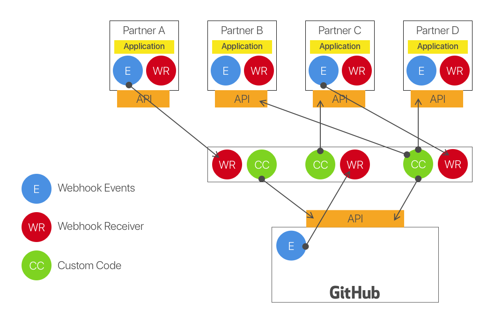

# What problem are we trying to solve?
We need a solution that allows our SI partners to automate SDLC workflows based on industry vertical needs.  These workflows and toolchains are currently being called _blueprints_ inside our partner community.  

Currently, integrating GitHub Enterprise into the SDLC requires the assumption that **every** SDLC workflow begins on GitHub Enterprise.  Our business partners see GitHub Enterprise as one of many products inside their customer's overall toolchain purchase.  As GitHub Enterprise evolves into a **Platform**, we need a way to simplify building integrations and workflows that can connect the overall SDLC.

_This is not a GitHub product and will not be supported by GitHub.  The goal is for our SIs to perform the development and delivery of these workflows with guidance from the GitHub Partners team_

# Requirements
Based on the current deployment requirements of GitHub Enterprise, we know there will be certain requirements from an infrastructure perspective that must be met from a customer perspective.

- Industry proven technology
- Security
- Load balancing
- High availability with clustering
- Logging
- Documented backup procedures
- Proven performance metrics
- Support for hybrid cloud offerings

From a partner perspective, both technology and integrator, the solution must meet these additional software requirements.

- Language agnostic
- Simple, well documented deployment options
- CLI integration for development testing
- Support for unit testing
- Ability to integrate with existing CI solutions
- Integrated workflow automation support
- Offline development support
- Industry support for methodology and technology
- Token storage and retrieval
- Ability to reuse functionality

# Current state of integrations with GitHub Enterprise
Most integrators started developing with GitHub using our [REST framework referenced under API v3](https://developer.github.com/v3/).  This version of the API would allow integrations to act on behalf of a GitHub user using either a [PAT (personal access token)](https://developer.github.com/v3/auth/#via-oauth-tokens) or with the [OAuth Authorizations API](https://developer.github.com/v3/oauth_authorizations/#create-a-new-authorization).  The integrations that were built using these techniques were normally point to point solutions and very heavyweight.  A developer would need to build out a full stack web application to leverage the OAuth Authorization workflow.

Therefore, the only people building integrations for GitHub were larger ISVs.  These integrations were considered very heavyweight.  It required them to build a webhook receiver to accept JSON payloads from GitHub.  They would need to parse the JSON payload and perform some action based on the contents of that JSON payload and respond to GitHub using the GitHub API.  To build a very simple integration, like a bot, it could take days to build and deploy.  For ISVs these integrations could take months.  

Due to the security concerns of OAuth, GitHub moved to a new model for extending it's platform called [GitHub Apps](https://developer.github.com/apps/building-github-apps/).  A GitHub developer, @bkeepers, built a reference implementation of a GitHub App in Node.js called [Probot](https://github.com/probot/probot).  Probot is great example of how you could extend GitHub :sparkles:.  This still uses the methodology where GitHub events are triggered via Webhooks and Probot is running an [Express](https://expressjs.com/) web server waiting to accept the JSON payload and perform some action based on that data.  Since we don't know when an action will get triggered, the Probot App must be always available.  This creates some concern with our Enterprise customers as some regulated workflows will depend on this integration for moving code throughout the SDLC.  If this capability is down, an exception would need to be established in InfoSec to allow a manual trigger to move the state forward.  

# How are **Ghapplets** (GitHub Applets) different?
We took a look at the Probot architecture and broke it into it's primary components.  When we did this, we realized we could standardize the webhook receiver (http server) into a middleware component.  This would leave us with the ability to trigger functional applications based on a URL of the incoming payload.  This gives us a way to load balance http requests across the infrastructure.  We could also leverage the load balancer to store messages into NATs or a Message Queue for delayed processing should a service be down allowing for guaranteed delivery of the messages.  

Since we didn't want to build out our own technology stack, we looked across the industry for how others were solving this problem.  We found the common way this is being solved is with [FaaS (Function as a Service)](https://stackify.com/function-as-a-service-serverless-architecture/).  The primary capability we saw was

> Services that are event-driven and instantaneously scalable

This allows us to build lightweight functions to perform actions based on any webhook event from any product in the SDLC.

# What is a Ghapplet?
Please refer to [our "vision" deck](vision/GitHubAppletsVisionDeck.pdf) while we scope out some deliverables in our Project Board.

# Next Steps
We are going to build out a few proof of concepts that we can share with our partners.  We would like to leverage a GitHub organization to open source some of the building blocks required for integrations to other ISV products like JIRA On-Prem, ServiceNow, and Splunk.  The goal is to create [Helm](https://helm.sh/) charts that can be deployed into [Fission.io](https://fission.io/).  This will work on-premises with any K8S deployment including OpenShift Origin, Red Hat Container Platform, GKE On-premises, or Kubernetes Open Source.  A benefit of leveraging K8S is this will also work in any Public/Private/Hybrid Cloud environment as well.  Our future state for _blueprints_ will look something like this.

We are hoping SI partners and ISVs will build out components in an Open Source manner allowing customers to **stitch** together functions using the [Fission.io Workflows](https://fission.io/workflows/) functionality.

# More information
If you are interested in supporting this effort, please contact @leefaus, @pierluigi, or @webdog.
